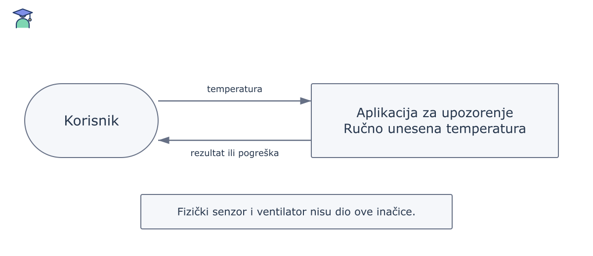

# Simulacija upozorenja

Ovo je **važna** uputa i *napomena*.

- temperatura
- upozorenje

> Vrijednost se unosi ručno. Fizički senzor nije povezan.

```json
{
  "temperature": 30,
  "threshold": 28,
  "simulated": true
}
```


